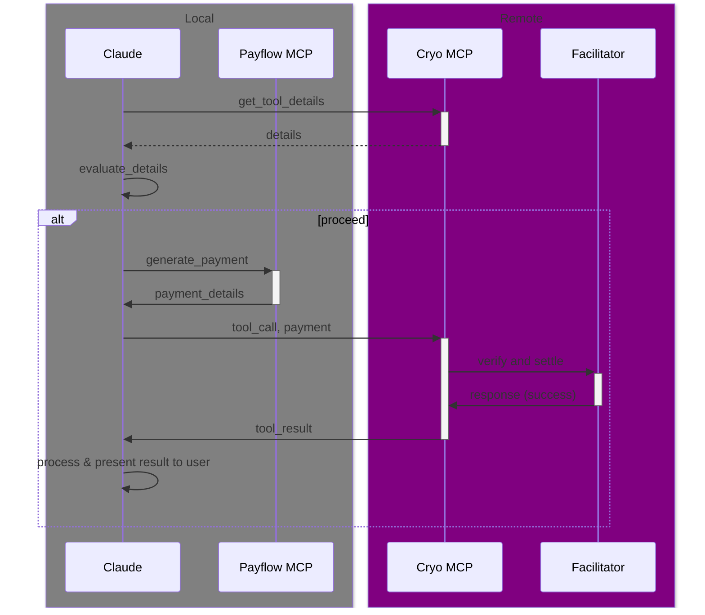

# Cryo MCP (with Payflow)

> https://cryo-mcp.fly.dev

Cryo MCP is an [MCP server](https://modelcontextprotocol.io/introduction) that allows you to extensively query blockchain data in natural language, powered by [Cryo](https://github.com/paradigmxyz/cryo) and [Reth](https://github.com/paradigmxyz/reth).

We host a remote MCP server at [https://cryo-mcp.fly.dev/v1/mcp](https://cryo-mcp.fly.dev/) that you can use to test it out. It is connected to a Reth archive node and has access to all datasets that [Cryo](https://github.com/paradigmxyz/cryo) provides:
```
cryo datasets
─────────────
- address_appearances
- balance_diffs
- balance_reads
- balances
- blocks
- code_diffs
- code_reads
- codes
- contracts
- erc20_balances
- erc20_metadata
- erc20_supplies
- erc20_transfers
- erc721_metadata
- erc721_transfers
- eth_calls
- four_byte_counts (alias = 4byte_counts)
- geth_calls
- geth_code_diffs
- geth_balance_diffs
- geth_storage_diffs
- geth_nonce_diffs
- geth_opcodes
- javascript_traces (alias = js_traces)
- logs (alias = events)
- native_transfers
- nonce_diffs
- nonce_reads
- nonces
- slots (alias = storages)
- storage_diffs (alias = slot_diffs)
- storage_reads (alias = slot_reads)
- traces
- trace_calls
- transactions (alias = txs)
- vm_traces (alias = opcode_traces)
```

It is also a demonstration of how to use [`payflow`](https://github.com/chainbound/payflow) to integrate micropayments into your MCP server. To use it, you need to have a local [payflow MCP server](https://github.com/chainbound/payflow/tree/main/packages/payflow-mcp) running that can create the payments for the paid tools.

## Claude Desktop Quickstart
1. Press `cmd+,` in Claude Desktop to open the settings
2. Go to the `Developer` tab
3. Click edit config and open the `claude_desktop_config.json` file
4. Add the `cryo` server to the `mcpServers` object:
5. Add the `payflow` server to the `mcpServers` object, with the correct configuration:

```json
{
  "mcpServers": {
    "cryo": {
      "command": "npx",
      "args": [
        "mcp-remote",
        "https://cryo-mcp.fly.dev/v1/mcp",
        "--header",
        "Authorization: test",
        "--transport",
        "http-only"
      ]
    },
    "payflow": {
      "command": "npx",
      "args": ["@chainbound/payflow-mcp"],
      "env": {
        "PRIVATE_KEY": "",
        // Set your max payment amount in USDC per tool call
        "MAX_PAYMENT_AMOUNT_USDC": "10",
        // Enable debug logging
        "DEBUG": "payflow:*"
      }
    }
  }
}
```

## Paid Tools
Only the dataset generation (`query_dataset`) tool is paid, using Coinbase x402 through the [`payflow-sdk`](../../packages/payflow-sdk) package. It currently costs **0.05 USDC** and is payable on Base.
The MCP server uses the facilitator hosted by Coinbase to settle the payments.

## Limits
We limit the number of blocks per query to 10,000. If your agent needs more data, you can use the `query_dataset` tool multiple times with multiple payments.

## Sequence Diagram
