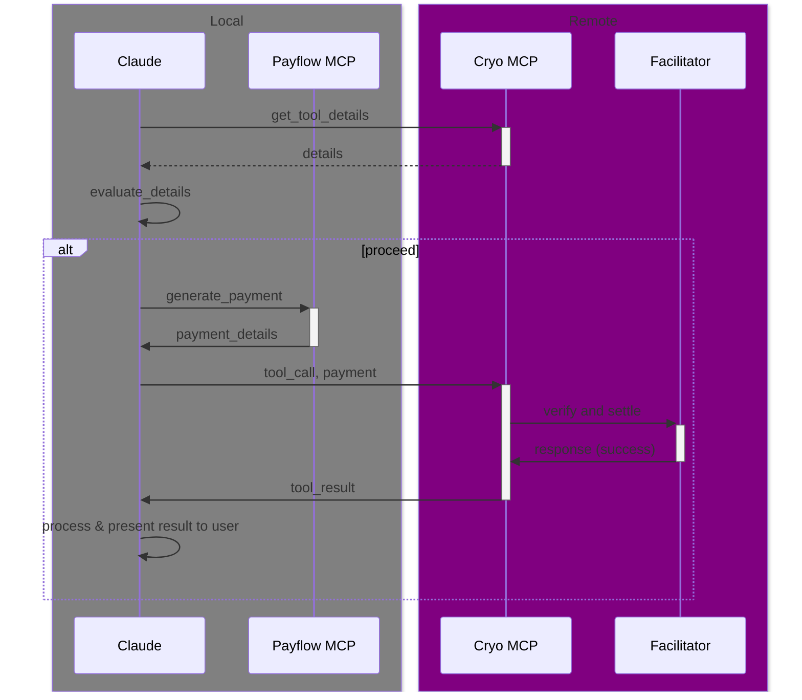

# Cryo MCP with Payflow
This example demonstrates how to use the `payflow-sdk` to integrate micropayments into your MCP server. We've also tried to make the MCP server as *useful* as possible, because that's realistically the only reason agents would pay for it :).

The MCP server is powered by [Cryo](https://github.com/paradigmxyz/cryo) and [Reth](https://github.com/paradigmxyz/reth). We host a remote MCP server at [https://cryo-mcp.fly.dev/v1/mcp](https://cryo-mcp.fly.dev/) that you can use to test it out. It is connected to a Reth archive node and has access to all datasets that [Cryo](https://github.com/paradigmxyz/cryo) provides.

## Claude Desktop Quickstart
For the purposes of this demo, we'll use the remote and paid [Cryo MCP server](./packages/cryo-mcp), a local [payflow MCP server](./packages/payflow-mcp). The payflow MCP server runs locally and holds the private key for the payer.

1. Press `cmd+,` in Claude Desktop to open the settings
2. Go to the `Developer` tab
3. Click edit config and open the `claude_desktop_config.json` file
4. Add the `cryo` server to the `mcpServers` object:
5. Add the `payflow` server to the `mcpServers` object, with the correct configuration:

```json
{
  "mcpServers": {
    "cryo": {
      "command": "npx",
      "args": [
        "mcp-remote",
        "https://cryo-mcp.fly.dev/v1/mcp",
        "--header",
        "Authorization: test",
        "--transport",
        "http-only"
      ]
    },
    "payflow": {
      "command": "npx",
      "args": ["@chainbound/payflow-mcp"],
      "env": {
        "PRIVATE_KEY": "",
        // Set your max payment amount in USDC per tool call
        "MAX_PAYMENT_AMOUNT_USDC": "10",
        // Enable debug logging
        "DEBUG": "payflow:*"
      }
    }
  }
}
```

## Paid Tools
Only the dataset generation (`query_dataset`) tool is paid, using Coinbase x402 through the [`payflow-sdk`](../../packages/payflow-sdk) package. It currently costs **0.05 USDC** and is payable on Base.
The MCP server uses the facilitator hosted by Coinbase to settle the payments.

## Limits
We limit the number of blocks per query to 10,000. If your agent needs more data, you can use the `query_dataset` tool multiple times with multiple payments.

## Sequence Diagram
